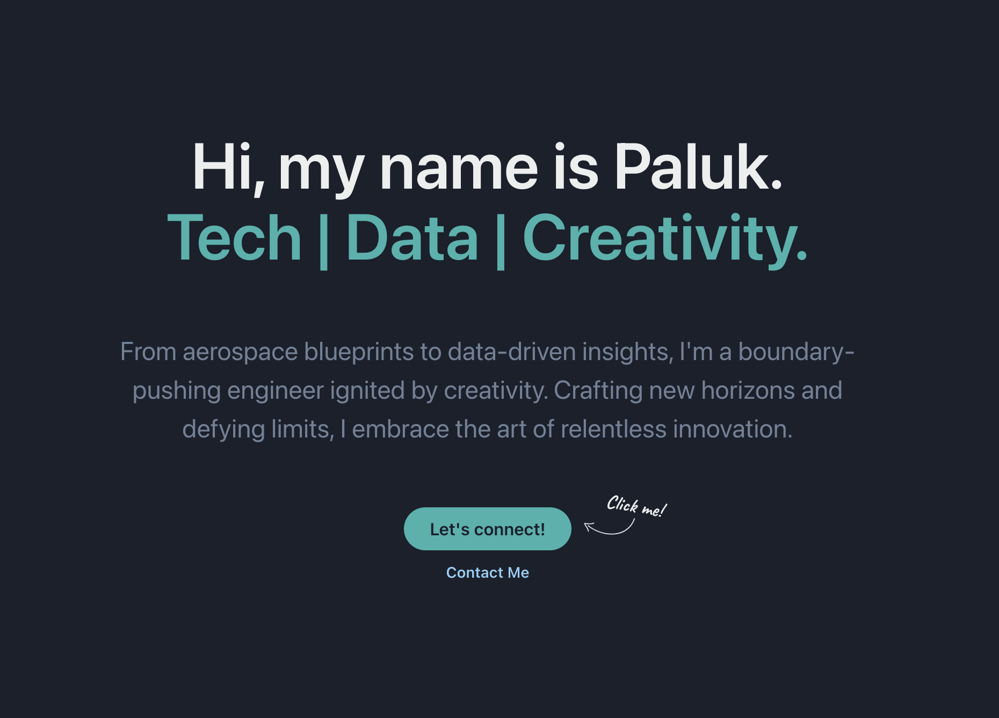

# Personal Portfolio

This portfolio is built using React.js and Chakra UI.

Website link: https://paluk-gupta-portfolio.netlify.app/

To test, you can use the following commands:

```
# Install dependencies
yarn install

# Start the development server
yarn start

# Build the static files
yarn build
```

After running `yarn start`, your website should be available at `http://localhost:3000`.


