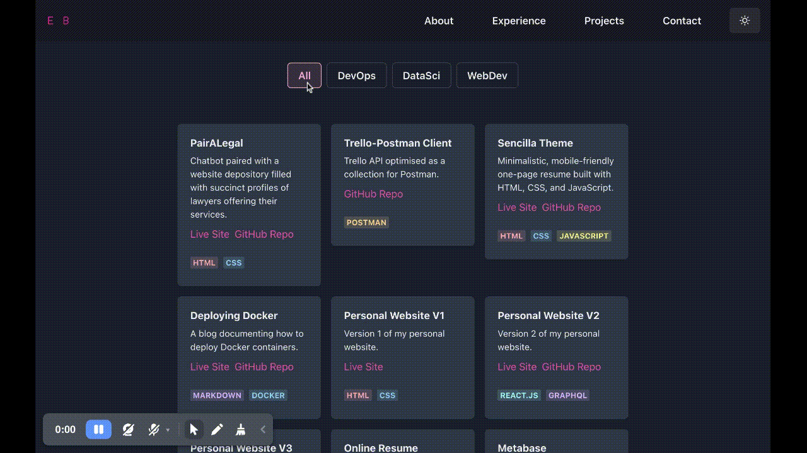

# Portfolio using React.js and Chakra UI

This portfolio is built using React.js and Chakra UI.

|        |  |
| :-----------------------------------------: | :-------------------------------: |
|       Document your work experiences        |    Showcase your best projects    |
|  |      |
|        Include your smaller projects        |     Mobile-responsive design      |


To test, you can use the following commands:

```
# Install dependencies
yarn install

# Start the development server
yarn start

# Build the static files
yarn build
```

After running `yarn start`, your website should be available at `http://localhost:3000`.


